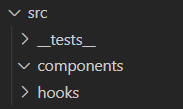
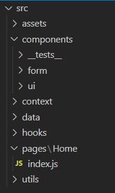
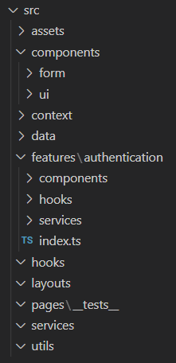

# reactjs-folder-structure-generator
A simple script that generates all folder structure you need (simple, intermediate, pro)

# Installation
- npm i
- npm start

# Usage
You can choose between Javascript and Typescript for index files, you can also choose the structure complexity and your ReactJS root folder.

# Available structures
- Simple    
- Intermediate    
- Professional    
